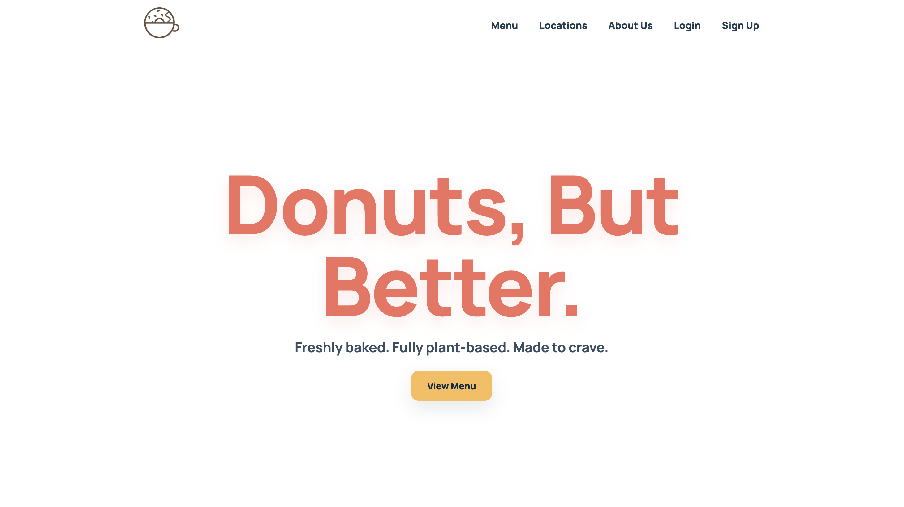
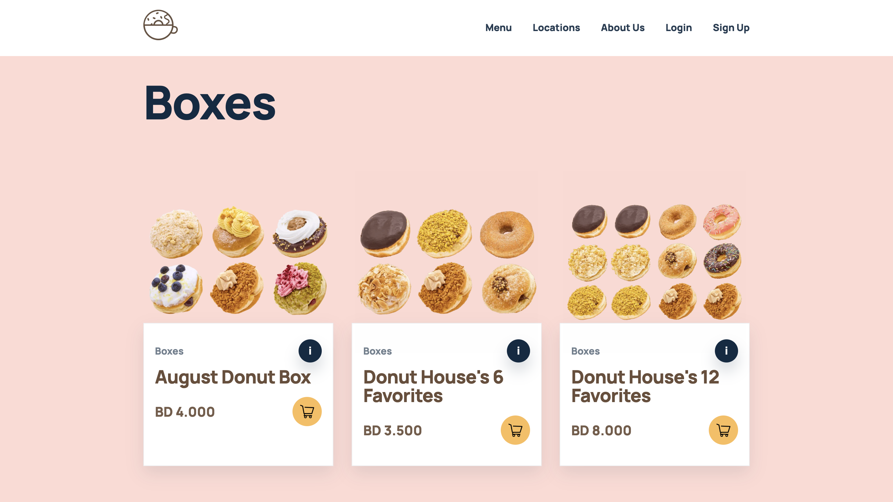
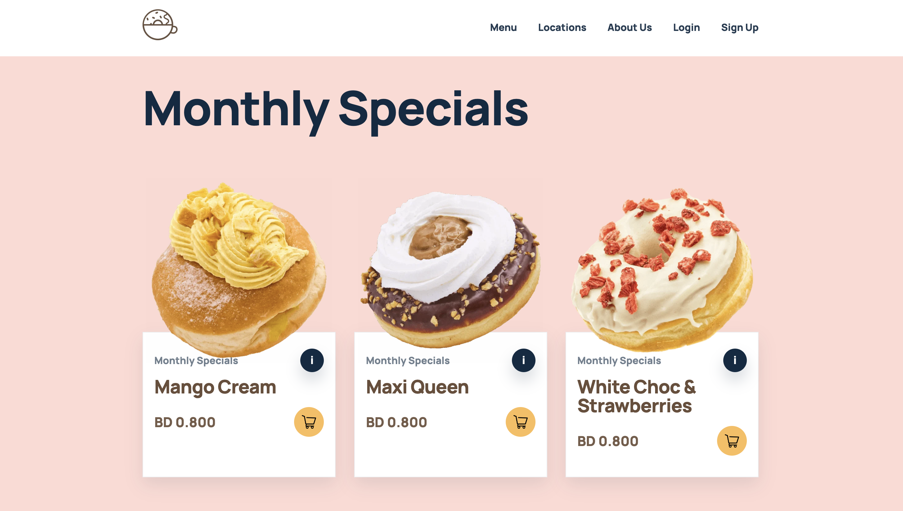
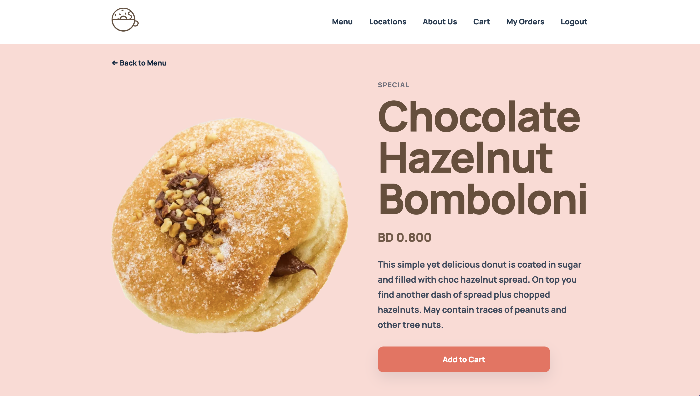
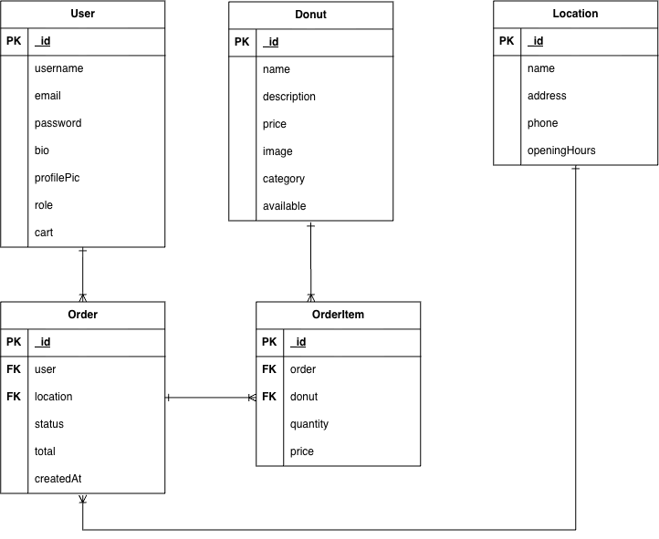

# 🍩 Donut House

Donut House is a full-stack donut ordering web application where customers can browse donuts, add items to their cart, place orders, view their order history, and find pickup locations. Administrators can manage donuts, locations, and customer orders through an admin dashboard.









## ✨ Features

### 👤 Authentication

* Sign up and log in
* Session-based authentication
* Customer and admin roles
* Secure logout
* Customer profile management

### 🍩 Donut Menu

* Browse available donuts
* View individual donut details
* View donut images hosted with Cloudinary
* Add donuts to the cart
* Admins can create, edit, and delete donuts

### 🛒 Cart

* Add donuts to the cart
* Change donut quantities
* Remove donuts from the cart
* View the current cart
* Calculate the cart total

### 📦 Orders

* Create orders from the cart
* Select a pickup location
* Calculate order totals
* View previous orders
* View individual order details
* View order status
* Cancel orders when allowed
* Admins can view all customer orders
* Admins can update order status
* Admins can delete orders

### 📍 Locations

* View Donut House pickup locations
* View individual location details
* Display opening and closing hours
* Show whether a location is currently open or closed
* Admins can create, edit, and delete locations

### 🛠️ Admin Dashboard

* View total orders
* View total donuts
* View total locations
* View total customers
* Manage orders
* Manage donuts
* Manage locations

---

## 👥 User Roles

### Customer

* Browse donuts
* View donut details
* Add donuts to the cart
* Manage cart quantities
* Place orders
* Select a pickup location
* View previous orders
* View order details and status
* View Donut House locations

### Admin

* Access the admin dashboard
* Create, edit, and delete donuts
* Create, edit, and delete locations
* View all customer orders
* Update order status
* Delete orders

---

## 📝 Planning

### Customer / General User Stories

* As a general user, I can view the home page explaining what Donut House offers.
* As a user, I can sign up and log in to my account.
* As a user, I can log out of my account.
* As a user, I can view and edit my profile.
* As a general user, I can view all available donuts.
* As a general user, I can view the details of a specific donut.
* As a user, I can add donuts to my cart.
* As a user, I can change the quantity of donuts in my cart.
* As a user, I can remove donuts from my cart.
* As a user, I can view my current cart before placing an order.
* As a user, I can select a pickup location.
* As a user, I can place an order.
* As a user, I can view my previous orders.
* As a user, I can view the details and status of a specific order.
* As a user, I can cancel an order if it has not been processed.
* As a general user, I can view available Donut House locations.
* As a general user, I can view the details of a specific location.

### Admin User Stories

* As an admin, I can access an admin dashboard.
* As an admin, I can view order statistics.
* As an admin, I can create a new donut.
* As an admin, I can edit a donut.
* As an admin, I can delete a donut.
* As an admin, I can create a Donut House location.
* As an admin, I can edit a location.
* As an admin, I can delete a location.
* As an admin, I can view all customer orders.
* As an admin, I can update an order's status.
* As an admin, I can delete an order.

---

## 🗺️ ERD



---

## 🖼️ Wireframes


[View and edit the wireframes in Excalidraw](https://excalidraw.com/#json=Pznz9kRXvud33jka_9O8I,38zMoYgD-XgnHRfZ4iqXuA)

---

## 🗄️ Data Models

### User

Stores customer and administrator account information, including username, email, password, role, and cart information.

### Donut

Stores donut information including name, description, price, category, availability, and Cloudinary image URL.

### Order

Stores the customer, pickup location, order items, total, and order status.

### OrderItem

Stores the donut, quantity, and price for each item in an order.

### Location

Stores the pickup location name, address, city, phone number, opening hours, closing hours, and availability.

---

## 🍩 Donut Routes

| HTTP Method | Route              | Action | Description                          |
| ----------- | ------------------ | ------ | ------------------------------------ |
| GET         | `/donuts`          | Index  | Displays all available donuts        |
| GET         | `/donuts/new`      | New    | Shows a form to create a donut       |
| POST        | `/donuts`          | Create | Creates a new donut                  |
| GET         | `/donuts/:id`      | Show   | Displays details of a specific donut |
| GET         | `/donuts/:id/edit` | Edit   | Shows a form to edit a donut         |
| PUT         | `/donuts/:id`      | Update | Updates a specific donut             |
| DELETE      | `/donuts/:id`      | Delete | Deletes a specific donut             |

---

## 🛒 Cart Routes

| HTTP Method | Route            | Action | Description                       |
| ----------- | ---------------- | ------ | --------------------------------- |
| GET         | `/cart`          | Index  | Displays the user's shopping cart |
| POST        | `/cart/:donutId` | Add    | Adds a donut to the cart          |
| PUT         | `/cart/:donutId` | Update | Updates the quantity of a donut   |
| DELETE      | `/cart/:donutId` | Remove | Removes a donut from the cart     |

---

## 📦 Order Routes

| HTTP Method | Route                      | Action        | Description                           |
| ----------- | -------------------------- | ------------- | ------------------------------------- |
| GET         | `/orders`                  | Index         | Displays the logged-in user's orders  |
| GET         | `/orders/:id`              | Show          | Displays details of a specific order  |
| POST        | `/orders`                  | Create        | Creates an order from the user's cart |
| PUT         | `/orders/:id`              | Update        | Updates an order                      |
| DELETE      | `/orders/:id`              | Delete        | Deletes an order                      |
| GET         | `/orders/admin`            | Admin Index   | Displays all customer orders          |
| PUT         | `/orders/admin/:id/status` | Update Status | Updates an order's status             |

---

## 📍 Location Routes

| HTTP Method | Route                 | Action | Description                             |
| ----------- | --------------------- | ------ | --------------------------------------- |
| GET         | `/locations`          | Index  | Displays all pickup locations           |
| GET         | `/locations/new`      | New    | Shows a form to create a location       |
| POST        | `/locations`          | Create | Creates a new pickup location           |
| GET         | `/locations/:id`      | Show   | Displays details of a specific location |
| GET         | `/locations/:id/edit` | Edit   | Shows a form to edit a location         |
| PUT         | `/locations/:id`      | Update | Updates a pickup location               |
| DELETE      | `/locations/:id`      | Delete | Deletes a pickup location               |

---

## 👤 Authentication Routes

| HTTP Method | Route            | Action   | Description                                |
| ----------- | ---------------- | -------- | ------------------------------------------ |
| GET         | `/auth/sign-up`  | Sign Up  | Displays the registration form             |
| POST        | `/auth/sign-up`  | Register | Creates a new customer account             |
| GET         | `/auth/sign-in`  | Sign In  | Displays the login form                    |
| POST        | `/auth/sign-in`  | Login    | Logs in the user and starts a session      |
| GET         | `/auth/sign-out` | Logout   | Logs out the user and destroys the session |

---

## 🛠️ Technologies

* Node.js
* Express.js
* MongoDB
* Mongoose
* EJS
* HTML5
* CSS3
* JavaScript
* Express Session
* bcrypt
* Cloudinary
* Git
* GitHub

---

## 📁 Project Structure

```text
donut-house/
│
├── config/                     # Application configuration
│   ├── cloudinary.js           # Cloudinary image upload configuration
│   └── database.js             # MongoDB database connection
│
├── controllers/                # Handles application logic
│   ├── authCtrl.js             # Authentication logic
│   ├── adminCtrl.js            # Admin dashboard logic
│   └── other controller files  # Donut, order, cart, and location logic
│
├── docs/                       # Project documentation
│   ├── erd.png                 # Entity Relationship Diagram
│   └── wireframes.png          # Application wireframes
│
├── middleware/                # Authentication and authorization middleware
│
├── models/                    # MongoDB/Mongoose data models
│   ├── User.js                 # User account and role data
│   ├── Donut.js                # Donut menu data
│   ├── Order.js                # Customer order data
│   ├── OrderItem.js            # Individual items within an order
│   └── Location.js             # Pickup location data
│
├── public/                    # Static files
│   ├── stylesheets/            # CSS files
│   ├── images/                 # Website images
│   └── javascript/             # Client-side JavaScript
│
├── routes/                    # Application URL routes
│   ├── aboutRouter.js          # About page routes
│   ├── adminRouter.js          # Admin dashboard routes
│   ├── cartRouter.js           # Shopping cart routes
│   ├── donutRouter.js          # Donut routes
│   ├── locationRouter.js       # Location routes
│   ├── orderRouter.js          # Order routes
│   └── pagesRouter.js          # General page routes
│
├── views/                     # EJS templates
│   │
│   ├── about/                  # About page
│   │   └── index.ejs
│   │
│   ├── admin/                  # Admin dashboard pages
│   │   ├── index.ejs           # Admin dashboard
│   │   ├── edit.ejs            # Admin edit page
│   │   └── new.ejs             # Admin creation page
│   │
│   ├── auth/                   # Authentication pages
│   │   ├── index.ejs
│   │   ├── show.ejs
│   │   └── new.ejs
│   │
│   ├── cart/                   # Shopping cart pages
│   │   ├── index.ejs
│   │   ├── show.ejs
│   │   └── new.ejs
│   │
│   ├── donuts/                 # Donut pages
│   │   ├── index.ejs           # Donut menu
│   │   ├── show.ejs            # Donut details
│   │   ├── edit.ejs            # Edit donut
│   │   └── new.ejs             # Add donut
│   │
│   ├── locations/              # Location pages
│   │   ├── index.ejs           # All locations
│   │   ├── show.ejs            # Location details
│   │   ├── edit.ejs            # Edit location
│   │   └── new.ejs             # Add location
│   │
│   ├── orders/                 # Order pages
│   │   ├── index.ejs           # Customer order history
│   │   ├── show.ejs            # Order details
│   │   ├── edit.ejs            # Edit/update order
│   │   └── new.ejs             # Create order
│   │
│   └── partials/               # Reusable EJS components
│       ├── _navbar.ejs         # Main navigation bar
│       ├── _footer.ejs         # Website footer
│       └── _adminSidebar.ejs   # Admin navigation sidebar
│
├── .env                        # Environment variables
├── .gitignore                  # Files ignored by Git
├── package.json                # Project dependencies and scripts
├── package-lock.json           # Locked dependency versions
├── server.js                   # Main application/server file
└── README.md                   # Project documentation
```

---

## 🚀 Getting Started

### 1. Clone the repository

```bash
git clone https://github.com/fatema-maitham/donut-house.git
cd donut-house
```

### 2. Install dependencies

```bash
npm install
```

### 3. Create a `.env` file

```env
MONGODB_URI=your_mongodb_connection_string
SESSION_SECRET=your_session_secret
CLOUDINARY_CLOUD_NAME=your_cloudinary_cloud_name
CLOUDINARY_API_KEY=your_cloudinary_api_key
CLOUDINARY_API_SECRET=your_cloudinary_api_secret
```

### 4. Start the application

```bash
npm run dev
```

The application will run at:

```text
http://localhost:3000
```

---

## 🎯 Project Goal

The goal of Donut House is to build a complete full-stack web application that demonstrates:

* Authentication and authorization
* Role-based access control
* CRUD operations
* MongoDB and Mongoose relationships
* Session management
* Shopping cart functionality
* Customer ordering
* Pickup location management
* Admin management
* Image uploads using Cloudinary
* Responsive web design

---

## 📌 Future Improvements

* Online payment integration
* Order notifications
* Customer reviews and ratings
* Order tracking
* Search and filtering
* More advanced customer account features

---

## 🌐 Demo

[Visit Donut House](https://donut-house.onrender.com)

---

## 🔗 Attributions

* [Brammibals Donuts](https://www.brammibalsdonuts.com/) — Used as a visual and design reference for the Donut House application.
